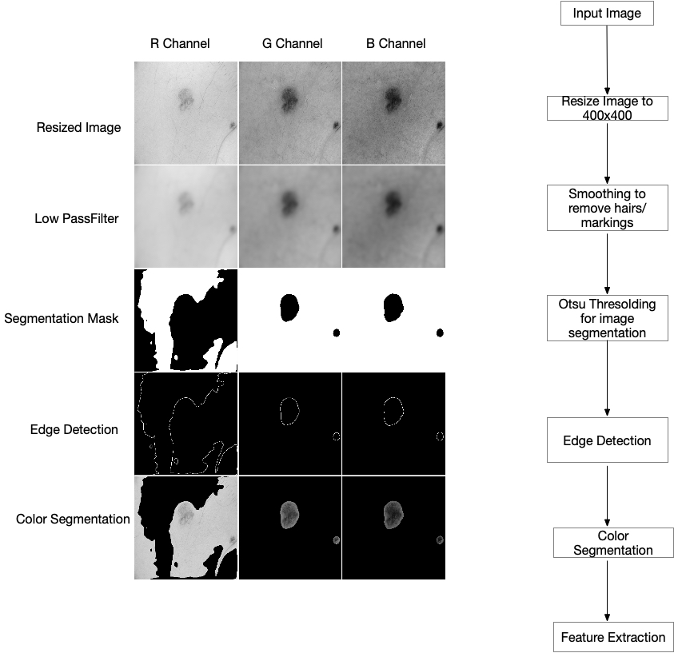

```{r setup, include=FALSE}
  knitr::opts_chunk$set(include = TRUE)  # TRUE for solution; FALSE for questions set
  knitr::opts_chunk$set(echo = TRUE)
  knitr::opts_chunk$set(message = FALSE)
  knitr::opts_chunk$set(warning = FALSE)
  knitr::opts_chunk$set(fig.height = 6, fig.width = 8, out.width = '100%', fig.align = "center")
  options(width = 100)
```

```{css, echo=FALSE}
.solution {
background-color: #e6ffe6;
}
```


```{r include = FALSE}
  rm(list = ls(all.names = TRUE))
  mypackages = c("knitr", "kableExtra", "grid", "gridExtra", "EBImage", "class", "randomForest", "caret", "e1071", "doMC", "factoextra", "glmnet", "tidytext", "tidyverse")
  tmp = setdiff(mypackages, rownames(installed.packages()))
  if (length(tmp) > 0)
    install.packages(tmp, repos = "http://cran.us.r-project.org")
```

```{r include = FALSE}
  rm(list = ls())
  library(tidyverse)
  library(knitr)
  library(kableExtra)
  library(grid)
  library(gridExtra)
  library(class)
  library(randomForest)
  library(caret)
  library(e1071)
  library(doMC)
  library(factoextra)
  library(glmnet)
  library(EBImage)
  library(tidytext)
```

### [10 Points, half a page] Project description and summary.

#### Goal

Goal of this project is to identify malignent moles from benign moles. Provided image dataset has 150 benign and 150 malignent moles with varying resolutions. Some of the images have moles with hairs, markings on the microscope for measurement. This data has to be processed and classified to identify malignent moles from the benign ones. We look for model interpretability as one of the key attributes.

#### Approach

Approach for Q1 - we resized the images to 100x100 resolution and used that all pixel information to perform classification. 

For the first model we choose Lasso with best lambda which provided minimum misclassification error by doing 10 fold cross-validation and using that model for predicting the results. 

For the second model we choose to do the PCA as it's an excellent choice when it comes to images. Using the selected principal components, we trained a SVM model. SVM Model is sensitive to parameters chosen. We used tune.svm() for trying different values of gamma and cost. We picked the gamma and cost which gives minimum classification error. 

For the third model we use PCA features for training Random Forest model. We tried different values of no. of trees and no. of nodes to get the best parameters for the random forest model.

Approach for Q2 - as a starting point, we began from the directions provided by the American Academy of Dermatology association, which targeted the ABCD of melanoma detection. @aad [Link here]. This provided us the intuition needed to generate the features. ABCDE is an acronym for Asymmetry, Border, Color, Diameter and Evolving respectively. We extracted features which correlate to the attributes like Area, Perimeter, Circularity index, Color in the segmented region. We used Ridge Regression and Random Forest Model on this transformed dataset to see whether it improved the accuracy.

#### Results

```{r results, echo=FALSE, results='asis'}
  q1_results = data.frame("Model" = c("Lasso", "SVM", "Random Forest"), "Accuracy" = c("64.00%", "75.00%", "77.8%"))
  q2_results = data.frame("Model" = c("Lasso", "Random Forest", ""), "Accuracy" = c("74.00%", "73.33%", ""))
  
  t1 <- kable(q1_results, format = "latex", booktabs = T)
  t2 <- kable(q2_results, format = "latex", booktabs = T)
    
  cat(c("\\begin{table}[!htb]
    \\begin{minipage}{.5\\linewidth}
      \\caption{Q1 Results}
      \\centering",
        t1,
    "\\end{minipage}%
    \\begin{minipage}{.5\\linewidth}
      \\centering
        \\caption{Q2 Results}",
        t2,
    "\\end{minipage} 
    \\end{table}"
    ))  
```

We can see an improvement in classification accuracy for Lasso Model after we performed the transformation mentioned in second approach. We chose Lasso Model for both approaches as the model interpretability is high.

We see that the random forest overfits the training data but performs not as well on the test data. In both parts we see that the random forest performs only as good as the other models on test data despite it reaching 100% accuracy on the training data.

In part 2, where we develop our own features, we see that both Random Forest and Lasso Models predict differently on important features. However perimeter are important in both models. Both models conclude that the Red channel is of lesser iportance than Green and Blue channels. However the Random Forest gives importance to features like area, cirucuarity index and color(Blue channel providing better classification). The fact that all our generated features are based on literature, we can conclude that the Random Forest is a good model for classification.

### [5 Points, half a page] Data processing for Question 1.

We have used the EBImage package for processing and getting image data. We have crated the 2 matrix of 150x30000 each for benign and malignant files. We resize each image to 100x100 pixels and then used this resize image data as vector. As this data consists of 3 channels we got matrices with 100x100x3 cols and 150 rows. We used all the pixel information for the lasso model.

We then choose to do the PCA as PCA is an excellent choice when it comes to images because inherently due to its nature, there is spatial corellation among pixel. Instead of using all the pixels, we can signifcantly reduce the number of features which encompass most of the variation. After plotting some information as shown below we choose 27 components which accounts for over 90% of the variation. We split our data in 70/30 train and test data split and perormed SVM and RF on it.

```{r include = FALSE}
  get_image_data <- function(dirPath) {
    resize_w <- 100
    resize_h <- 100
    num_channels <- 3
    number_of_files <- 150

    image_mat <- matrix(NA, nrow = number_of_files, ncol = resize_w * resize_h * num_channels)
    image_files <- list.files(dirPath)

    count <- 1
    for (i in image_files) {
      file_open <- paste(dirPath, i, sep = "")
      img <- readImage(file_open)
      resize_img <- resize(img, resize_w, resize_h)
      mat_img <- resize_img@.Data
      vec_img <- as.vector(mat_img)
      image_mat[count, ] <- vec_img
      count <- count + 1
    }
    return(image_mat)
  }

  benign_mat <- get_image_data("542/benign/")
  malignant_mat <- get_image_data("542/malignant/")

  data_cancer <- rbind(benign_mat, malignant_mat)
  data_cancer <- cbind(c(rep(0, 150), rep(1, 150)), data_cancer)

  # Split train test 70/30 with all data
  set.seed(1)
  train = sample (1:nrow(data_cancer), nrow(data_cancer) * 0.7)
  train.data <- data_cancer[train,]
  test.data <- data_cancer[-train,]
  xtrain = train.data[, -1]
  ytrain = train.data[, 1]
  xtest = test.data[, -1]
  ytest = test.data[, 1]
  
  #PCA
  set.seed(1)
  train = sample (1:nrow(data_cancer), nrow(data_cancer) * 0.7)
  test <- (-train)
  pca.train <- data_cancer[train,]
  pca.test <- data_cancer[test,]
  colnames(pca.train) <- c("y",seq(1,30000))
  colnames(pca.test) <- colnames(pca.train)
  pca.Cancer <- prcomp(as.data.frame(pca.train[, -1]), scale. = FALSE)

  #frac_variance <- (pca.Cancer$sdev ^ 2) / sum(pca.Cancer$sdev ^ 2)
  #I chose first 30 components
  #sum(frac_variance[1:27])

  p1 <- fviz_screeplot(pca.Cancer, addlabels = F,ncp = 30, ylim = c(0, 50))

  p2 <- fviz_pca_ind(
    pca.Cancer,
    geom.ind = "point",
    pointshape = 21,
    pointsize = 2,
    fill.ind = pca.train[, 1],
    col.ind = "black",
    label = "var",
    legend.title = "Diagnosis"
  ) +
    ggtitle("2D PCA-plot from 30 feature dataset") +
    theme(plot.title = element_text(hjust = 0.5))
  
  #plot((pca.Cancer$sdev^2)[1:30], type="o", xlab = "Eigenvalue #", ylab = "Magnitude", main = "Magnitude of Eigenvalue")
```

```{r fig.height = 3, fig.width = 10, out.width = '100%', fig.align = "center", echo = FALSE}
  grid.arrange(p1, p2, ncol=2)
```

### [30 Points, within 5 pages] Classification models based on pixels.

### Classification Model 1. Lasso

For performing classification with the lasso we are selecting the family as binomial. We are using all the pixels which we got after resizing the image to 100x100 and we are using 3 channels. As we have split the data in 70/30 ratio, we got xtrain data as 210x30000 matrix and ytrain as  210 corresponding responses. xtest is 90x30000 matrix and ytest is corrsponding 90 responses.

```{r results = "hide"}
  # use parallel for performace
  registerDoMC(cores = 4)
  set.seed(1)
  cv_glmnet_model <- cv.glmnet(xtrain, ytrain, parallel = TRUE, alpha=1, nfolds = 10,
                               family="binomial", type.measure = "class")
  # selecting the lambda which provided minimum misclassification error as best lambda
  best_lambda = cv_glmnet_model$lambda.min
  # training with best lambda selected with 10 fold cross validation
  glmnet_model <- glmnet(xtrain, ytrain, lambda = best_lambda, alpha=1,
                         family="binomial", type.measure = "class")
  # predicting on test data
  pred <- predict(glmnet_model, s = best_lambda, newx = xtest, type = "class")
  accuracy = mean(ytest == pred) * 100
  lasso_results = data.frame("Best lambda" = best_lambda, "Accuracy" = as.numeric(accuracy,3))
  lasso_confusionMatrix <- confusionMatrix(as.factor(pred), as.factor(ytest))
```

```{r fig.height = 3, fig.width = 10, out.width = '100%', fig.align = "center", echo = FALSE}
  plot(cv_glmnet_model)
```

After performing the 10 fold validation and selecting the best lambda we retrained the model with the selected best lambda and family binomial and type.measure class and used this model for predicting class on the test data. We got around 68% accuracy for the test data.

```{r echo=FALSE, results='asis'}
  t1 <- kable(lasso_results, format = "latex", booktabs = T)
  t2 <- kable(lasso_confusionMatrix$table, format = "latex", booktabs = T)
    
  cat(c("\\begin{table}[!htb]
    \\begin{minipage}{.5\\linewidth}
      \\caption{Lasso Results}
      \\centering",
        t1,
    "\\end{minipage}%
    \\begin{minipage}{.5\\linewidth}
      \\centering
        \\caption{Lasso Confusion Matrix}",
        t2,
    "\\end{minipage} 
    \\end{table}"
    ))  
  
```

```{r include = FALSE}
  train.data <- data.frame(y = pca.train[, 1], pca.Cancer$x)
  train.data <- train.data[, 1:28]
  test.data <- predict(pca.Cancer, pca.test[, -1])
  test.data <- test.data[, 1:27]
```

### Classification Model 2. SVM with PCA

When we select only few features from the original dataset and build a linear SVM, we noticed an 80.47% training accuracy and a 65% validation set acccuracy. After increasing the number of features to 50, 70, 90, and 100, the training accuracy increased to 98% and flattened. However the test set accuracy dropped from 65% to 50%. We performed PCA and based on the graphs and the scores, we retained the 27 features PCA as the final choice. 

```{r include = TRUE}
  set.seed(1)
  tuned_svm <- tune(
    svm,
    train.x = train.data,
    train.y = train.data[, 1],
    kernel = "linear",
    range = list(
      cost = 10 ^ (-2:2),
      gamma = c(0.1, 0.25, 0.5, 0.75, 1, 2)
    )
  )
```

We noticed SVM is very sensitive to the choice of parameters. We trained a linear SVM model with the best parameters we got from tuning, gamma = 0.1 and cost = 1. We are also performing 10-fold cross validation to assess the quality of the model.

```{r}
  best_svm <- svm(
    as.factor(y) ~ .,
    data = train.data,
    kernel = "linear",
    cost = tuned_svm$best.parameters$cost,
    gamma = tuned_svm$best.parameters$gamma,
    cross = 10
  )
```

We tried different hyperplanes to separate the dataset. We noticed that a simple linear split is consistently performing well. 133 support vectors have been identified by the best svm model.

SVM for Training data : First two Principle Components
```{r fig.height = 4, fig.width = 10, out.width = '100%', fig.align = "center", echo = FALSE}
  plot(best_svm, train.data, PC1 ~ PC2)
```

```{r include = FALSE}
  svmPredTrain <- predict(best_svm, train.data)
  accuracy = mean(train.data[, 1] == svmPredTrain) * 100
  svm_results = data.frame("Train Data Accuracy" = as.numeric(accuracy,3))
  svm_train_confusionMatrix <- confusionMatrix(as.factor(svmPredTrain), as.factor(train.data[, 1]))
```

```{r include = FALSE}
  svmPred <- predict(best_svm, test.data)
  accuracy = mean(pca.test[, 1] == svmPred) * 100
  svm_results = data.frame("Test Data Accuracy" = as.numeric(accuracy,3))
  svm_test_confusionMatrix <- confusionMatrix(as.factor(svmPred), as.factor(pca.test[, 1]))
```

```{r include = FALSE}
  all_data_x <- rbind(test.data, train.data[, -1])
  all_data_y <- c(pca.test[, 1], train.data[, 1])
  svmPred <- predict(best_svm, all_data_x)
  accuracy = mean(all_data_y == svmPred) * 100
  svm_results = data.frame("Complete Data Accuracy" = as.numeric(accuracy,3))
  svm_confusionMatrix <- confusionMatrix(as.factor(svmPred), as.factor(all_data_y))
```

```{r echo=FALSE, results='asis'}
  t1 <- kable(svm_results, format = "latex", booktabs = T)
  t2 <- kable(svm_confusionMatrix$table, format = "latex", booktabs = T)
    
  cat(c("\\begin{table}[!htb]
    \\begin{minipage}{.5\\linewidth}
      \\caption{SVM with PCA Results}
      \\centering",
        t1,
    "\\end{minipage}%
    \\begin{minipage}{.5\\linewidth}
      \\centering
        \\caption{SVM Confusion Matrix}",
        t2,
    "\\end{minipage} 
    \\end{table}"
    ))  
```

Linear SVM with 133 support vectors, trained over 27 Principal Components performs consistently with training accuracy of 76% and testing accuracy of 71%.

### Classification Model 3. Random Forest with PCA

We used the dataset with 27 Principal Components to train a tree-based classification model. Random Forest is a popular decision tree model as it performs well for high-dimensional data and bins the outliers. Choice of no. of trees and no. of nodes is very important, so we did a grid search.

```{r results = "hide"}
   set.seed(1)
   num_trees <- c(1,10,50,100,500,1000,1250,2000)
   num_nodes <- c(1)
   all_data_x <- rbind(test.data, train.data[, -1])
   all_data_y <- c(pca.test[, 1], train.data[, 1])
   best_i <- 1
   best_j <- 1
   best_all_error <- 100
   
   for(i in num_trees) {
     for (j in num_nodes) {
       rfModel = randomForest(
         formula = as.factor(y) ~ .,
         data = train.data,
         importance = T,
         ntree = i,
         nodesize = j
       )
       temp <- cbind(as.numeric(as.character(rfModel$predicted)), (train.data$y))
       yhat.test = predict(rfModel, test.data)
       training_error <- length(which(temp[, 1] != temp[, 2])) * 100 / nrow(train.data)
       temp <- cbind(as.numeric(as.character(yhat.test)), (pca.test[, 1]))
       test_error <- length(which(temp[, 1] != temp[, 2])) * 100 / nrow(test.data)
       yhat.all <- predict(rfModel, all_data_x)
       temp <- cbind(as.numeric(as.character(yhat.all)), as.numeric(all_data_y))
       all_error <- length(which(temp[, 1] != temp[, 2])) * 100 / nrow(all_data_x)
       if (all_error < best_all_error) {
         best_i <- i
         best_j <- j
         best_all_error <- all_error
         best_rfModel <- rfModel
       }
     }
   }
```

```{r fig.height = 5, fig.width = 10, out.width = '100%', fig.align = "center", echo = FALSE}
   varImpPlot(best_rfModel, main="Variable Importance Plot")
```

This plot helps us in understanding the important variables chosen by the best random forest model. MeanDecreaseAccuracy helps us in understanding the importance of a variable's inclusion in reducing the classification error. MeanDecreaseGini helps us in understanding the relevance of variables in classification using node impurity (Gini). 


```{r fig.height = 3, fig.width = 10, out.width = '100%', fig.align = "center", echo = FALSE}
   plot(best_rfModel, main = "Best Random Forest Model", legend = c("bottomright", pch=1))
```


```{r}
yhat.train = predict(best_rfModel, train.data)
temp <- cbind(as.numeric(as.character(yhat.train)), (train.data[, 1]))
train_error <- length(which(temp[, 1] != temp[, 2])) * 100 / nrow(train.data)
train_accuracy = mean(train.data[,1] == yhat.train) * 100
```

```{r}
yhat.test = predict(best_rfModel, test.data)
temp <- cbind(as.numeric(as.character(yhat.test)), (pca.test[, 1]))
test_error <- length(which(temp[, 1] != temp[, 2])) * 100 / nrow(test.data)
test_accuracy = mean(pca.test[,1] == yhat.test) * 100
rf_results = data.frame("Train" = as.numeric(train_accuracy,3),"Test" = as.numeric(test_accuracy,3))
```

```{r include = FALSE}
  rfPred <- predict(best_rfModel, all_data_x)
  rf_confusionMatrix <- confusionMatrix(as.factor(rfPred), as.factor(all_data_y))
```

```{r echo=FALSE, results='asis'}
  t1 <- kable(rf_results, format = "latex", booktabs = T)
  t3 <- kable(rf_confusionMatrix$table, format = "latex", booktabs = T)
    
  cat(c("\\begin{table}[!htb]
    \\begin{minipage}{.5\\linewidth}
      \\caption{RandomForest with PCA Accuracy}
      \\centering",
        t1,
    "\\end{minipage}%
    \\begin{minipage}{.5\\linewidth}
      \\centering
        \\caption{RandomForest Confusion Matrix}",
        t2,
    "\\end{minipage} 
    \\end{table}"
    ))  
  
```

We run a random forest through a grid search through of number of trees (1 to 5000) and nodesize(1 to 50). We find that our best model is with 1000 trees and a nodesize of 20. Our accuracy on the entire set is 93.33%

Right off the bat we see that the Random Forest is overfitted. We achieve perfect accuracy on the training data set while out the 90 test data, 20 are classified incorrectly, hence the test accuracy of the data is 77.8%. A random forest will always overfit the training data. Despite this, random forest provides the test accuracy.

### [10 Points, 1 page] Literature review. You should search and read existing literature and summarize clinically relevant characteristics that could be used for skin cancer image diagnosis. There is no limitation on what type of literature you could use. However, the goal should be motivating your feature engineering approaches from a clinical and analytic point of view. Please give appropriate citations to the literature you read.

The American Academy of Dermatology Association (@aad) listes the ABCDE of detecting Melanoma. ABCDE is an acronym for Asymmetry, Border, Color, Diameter and Evolving respectively. Since in this project statement, are given a series of pictures over a lesion over a period of time, we will not be able to create a specific feature for Evolving. Hence, we concentrate on the remaining.

A great tools for us is EBImage which is package developed by @Pau2010 which provides us very usable functions for image processing tasks. We use various features of this package for our feature engineering.
@RA2012 provides high level features one could use to help engineer our features. Their main work talks about the different way to quantize irregularities. They use a mix of both coarse and fine grain methods to achieve this.

@SJ2015 Shivangi et al, also talks about a good pipeline to this. Their work diffs in that they introduce quantitative metrics to mark irregulaties in shape. They also take into account the size of the lesion. However to this accurately they must have ensured that the each image is taken from the same distance and focus. We do not have that information regarding our dataset, so we must rely on ration. One of the interesting features proposed in using Circularity Index, it is the ration of (4*pi*Area)/(Perimeter*Perimeter). This is a geat metric becaus this is scale invariant.
Of course is @SJ2015 and @Pau@2010, they do concentrate a fair amount on preprocessing steps like illumination and segmentation.

### [10 Points, 1 page] Feature engineering. Motivated by what you have read (or your understanding), process the data in a reasonable way such that the new variables are more intuitive to your collaborator/clinicians. You need to describe clearly what is your data processing criteria and how your variables are calculated.

```{r fig.height = 6, fig.width = 8, out.width = '100%', fig.align = "center", echo = FALSE}
  
```

Our pipeline takes an input image and prepares it for feature extraction. Once, we have our features, we then run it through various classifiers to observe the results. All steps in the preprocessing steps are done in 3 planes. We keep results from all these planes, as the classifier should be able to choose from them.
Preprocessing steps :

1. Resize all images to 400 x400
2. Convert Color to Grayscale but also preseve the color image.
3. We run it through a low pass filter to remove hairs and scale markings.

Preprocessing steps :
Do notice from the image above that the red channel does not yield very good preprocessing results while the green and blue channels are very successful in isolation the regions.

We generate 5 features for each of the channels:

1. Area: We count the number pixels in the mask of segmentation which are 0.
2. Perimeter: In the edge detected image, we count the number of pixels which are 1.
3. After applying the segmentation mask on the color image, we sum the total pixels that are in the segmented area.
4. Regularity Parameter: The ration of area / perimeter
5. Circularity Index: The ratio of (4*pi*area)/(perimeter^2)


### [20 Points, 2 page] Classification models based on new features. Fit two different classification models to identify malignant moles. You can either use the ones from Question 1 or use some new models if you believe they may perform better on the new features. Same requirements of Question 1 apply to this part. Besides, you should focus more on variable selection and interpretation.

```{r}
  extract_features <- function(img_in) {
    resize_w <- 400
    resize_h <- 400
    img_resize <- resize(img_in, resize_w, resize_h)
    img_gray <- img_resize
    colorMode(img_gray) = Grayscale

    #Low Pass filter
    w = makeBrush(size = 31, shape = 'gaussian', sigma = 5)
    img_lp = filter2(img_gray, w)
    img_in_th <- img_lp
    threshold <- otsu(img_in_th)
    img_th = EBImage::combine(mapply(function(frame, th) frame > th, 
                                     getFrames(img_in_th), threshold, SIMPLIFY = FALSE))
    img_th_val <- img_th
    img_th_val[which(img_th) == TRUE] <- 1
    img_th_val[which(img_th) == TRUE] <- 0
    fhi = matrix(1, nrow = 3, ncol = 3)
    fhi[2, 2] = -8
    img_fhi = filter2(img_th_val, fhi)
    img_fhi_col <- filter2(img_gray, fhi)

    #Features based on preprocessing
    area_f <- c(0, 0, 0)
    perimeter_f <- c(0, 0, 0)
    rgb_f <- c(0, 0, 0)
    img_col_thresh <- img_resize * img_th_val
    
    for (i in 1:3) {
      area_f[i] <- length(which(img_th_val[, , i] == 0)) / (resize_h * resize_w)
      perimeter_f[i] <- length(which(img_fhi[, , i] == 1)) / (resize_h * resize_w)
      rgb_f[i] <- sum(img_col_thresh[which(img_th_val[, , i] == 0)]) / (resize_h * resize_w)
    }
    
    reg_f <- area_f / perimeter_f
    return(c(area_f, perimeter_f, rgb_f, (area_f/perimeter_f), (4*pi*area_f/perimeter_f^2)))
  }
```

```{r include=FALSE}
  process_images <- function(dirPath) {
    number_of_files <- 150
    img_mat <- matrix(NA, nrow = number_of_files, ncol = 15)
    image_files <- list.files(dirPath)
    count <- 1
    
    for (i in image_files) {
      file_open <- paste(dirPath, i, sep = "")
      img <- readImage(file_open)
      img_mat[count, ] <- extract_features(img)
      count <- count + 1
    }
    return(img_mat)
  }
  
  benign_mat <- process_images("542/benign/")
  malignant_mat <- process_images("542/malignant/")

  # Create the dataset
  data_cancer <- rbind(benign_mat, malignant_mat)
  data_cancer <- cbind(c(rep(0, 150), rep(1, 150)), data_cancer)
  colnames(data_cancer) <- c("y","area_r","area_g","area_b","perimeter_r","permiter_g","perimeter_b","color_r","color_g","color_b",
                             "reg_r","reg_g","reg_b","crc_r","crc_g","crc_b")
  data_cancer[which(is.infinite(data_cancer) == TRUE)] <- 0
  set.seed(1)
  train = sample (1:nrow(data_cancer), nrow(data_cancer) * 0.7)
  train.data <- data_cancer[train, ]
  test.data <- data_cancer[(-train), ]
  xtrain = train.data[, -1]
  ytrain = train.data[, 1]
  xtest = test.data[, -1]
  ytest = test.data[, 1]
```

### Classification Model 1. Lasso

For performing classification with the lasso we are selecting the family as binomial. We are using selected 15 features as xtrain and ytrain is corrsponding response.

```{r results = "hide"}
  set.seed(1)
  cv_glmnet_model <- cv.glmnet(xtrain, ytrain, parallel = TRUE, alpha=1, nfolds = 10,
                               family="binomial", type.measure = "class")
  # selecting the lambda which provides the minimum clasification error as best lambda
  best_lambda = cv_glmnet_model$lambda.min
  # training with best lambda selected with 10 fold cross validation
  glmnet_model <- glmnet(xtrain, ytrain, lambda = best_lambda, alpha=1,
                         family="binomial", type.measure = "class")
  # predicting on test data
  pred <- predict(glmnet_model, s = best_lambda, newx = xtest, type = "class")
  accuracy = mean(ytest == pred) * 100
  lasso_results = data.frame("Best lambda" = best_lambda, "Accuracy" = as.numeric(accuracy,3))
  lasso_confusionMatrix <- confusionMatrix(as.factor(pred), as.factor(ytest))
```

```{r fig.height = 3, fig.width = 10, out.width = '100%', fig.align = "center", echo = FALSE}
  plot(cv_glmnet_model)

  #coef(cv_glmnet_model, s = "lambda.min")

  p6 <- cv_glmnet_model$glmnet.fit %>%
    tidy() %>%
    filter(lambda == best_lambda, term != "(Intercept)") %>%
    select(term = term, coefficient = estimate) %>%
    arrange(coefficient) %>%
    top_n(15, abs(coefficient)) %>%
    mutate(term = fct_reorder(term, coefficient)) %>%
    ggplot(aes(term, coefficient)) +
    geom_col(color = "skyblue", fill = "lightblue") +
    coord_flip() +
    scale_y_log10() +
    labs(x = "",
         y = "Importance of feature",
         title = "Plot: What features are important in prediction")
  
```

After performing the 10 fold validation and selecting the best lambda we retrained the model with the selected best lambda and family binomial and type.measure class and useed that model for predicting class on the test data. Accuracy we got is around 72%

```{r fig.height = 4, fig.width = 10, out.width = '100%', fig.align = "center", echo = FALSE}
  p6
```

By looking at this plot we can say that perimeter is the important fearure especially with color b and g after that we can see area also plays and important role.

```{r echo=FALSE, results='asis'}
  t1 <- kable(lasso_results, format = "latex", booktabs = T)
  t2 <- kable(lasso_confusionMatrix$table, format = "latex", booktabs = T)
    
  cat(c("\\begin{table}[!htb]
    \\begin{minipage}{.5\\linewidth}
      \\caption{Lasso Results}
      \\centering",
        t1,
    "\\end{minipage}%
    \\begin{minipage}{.5\\linewidth}
      \\centering
        \\caption{Lasso Confusion Matrix}",
        t2,
    "\\end{minipage} 
    \\end{table}"
    ))  
  
```

### Classification Model 2. Random Forest

```{r}
  set.seed(1)
  num_trees <- c(1,10,50,100,500,1000,1250,1500,2000)
  num_nodes <- c(1)
  all_data_x <- rbind(test.data[,-1],train.data[,-1])
  all_data_y <- c(test.data[,1],train.data[,1])
  best_i <- 1;
  best_j <- 1;
  best_all_error <- 100
  for(i in num_trees){
    for(j in num_nodes){
      rfModel = randomForest(formula = as.factor(y) ~ ., data = train.data, importance = T, ntree=i, nodesize = j)
      temp <- cbind(as.numeric(as.character(rfModel$predicted)),(train.data[,1]))
      yhat.test = predict(rfModel, test.data)
      training_error <- length(which(temp[,1]!=temp[,2]))*100/nrow(train.data)
      temp <- cbind(as.numeric(as.character(yhat.test)),(test.data[,1]))
      test_error <- length(which(temp[,1]!=temp[,2]))*100/nrow(test.data)
      yhat.all <- predict(rfModel,all_data_x)
      temp <- cbind(as.numeric(as.character(yhat.all)),as.numeric(all_data_y))
      all_error <- length(which(temp[,1]!=temp[,2]))*100/nrow(all_data_x)
      #cat("Num of Trees:",i,"Num of nodes:",j," Training Error:",training_error," Test Error:",test_error," All Error:",all_error,"\n")
      if(all_error < best_all_error){
        best_i <- i
        best_j <- j
        best_all_error <- all_error
        best_rfModel <- rfModel
      }
    }
  }
```

As with question1, we run through a random forest model with a grid search on number of tress and nodesize. The best model was with 100 trees and 5 nodesize with an accuracy of 92%.

```{r fig.height = 5, fig.width = 10, out.width = '100%', fig.align = "center", echo = FALSE}
  varImpPlot(best_rfModel)
```

```{r}
yhat.train = predict(best_rfModel, train.data)
temp <- cbind(as.numeric(as.character(yhat.train)), (train.data[, 1]))
train_error <- length(which(temp[, 1] != temp[, 2])) * 100 / nrow(train.data)
train_accuracy = mean(train.data[,1] == yhat.train) * 100
```

```{r}
yhat.test = predict(best_rfModel, test.data)
temp <- cbind(as.numeric(as.character(yhat.test)), (test.data[, 1]))
test_error <- length(which(temp[, 1] != temp[, 2])) * 100 / nrow(test.data)
test_accuracy = mean(test.data[,1] == yhat.test) * 100
rf_results = data.frame("Train" = as.numeric(train_accuracy,3), "Test" = as.numeric(test_accuracy,3))
```

```{r include = FALSE}
  rfPred <- predict(best_rfModel, all_data_x)
  rf_confusionMatrix <- confusionMatrix(as.factor(rfPred), as.factor(all_data_y))
```

```{r echo=FALSE, results='asis'}
  t1 <- kable(rf_results, format = "latex", booktabs = T)
  t2 <- kable(rf_confusionMatrix$table, format = "latex", booktabs = T)
    
  cat(c("\\begin{table}[!htb]
    \\begin{minipage}{.5\\linewidth}
      \\caption{RandomForest Train Results}
      \\centering",
        t1,
    "\\end{minipage}%
    \\begin{minipage}{.5\\linewidth}
      \\centering
        \\caption{RandomForest Confusion Matrix}",
        t2,
    "\\end{minipage} 
    \\end{table}"
    ))  
  
```

By Making understandable features, we see from above that:

 - Area, color and perimeter are key features. If the lesion contains multiple colors, then as @aad explained, it is a high chance of cancer.
 - The next set of feature are the regularity and circularity index respectively.
 - Red is the least important channel in the model. We saw during preprocessing as well, the Red plane didn not yield good results as well.


### References
